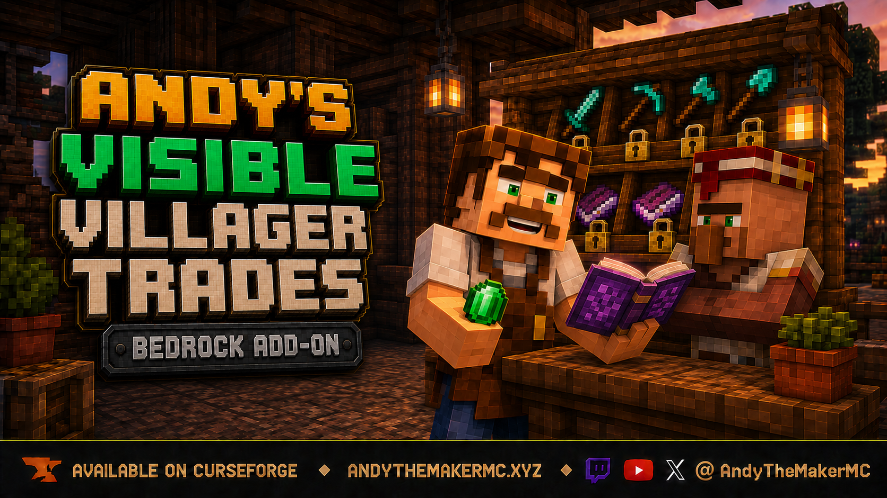
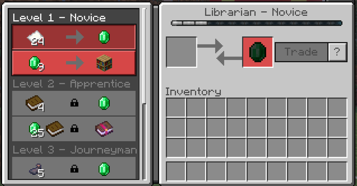
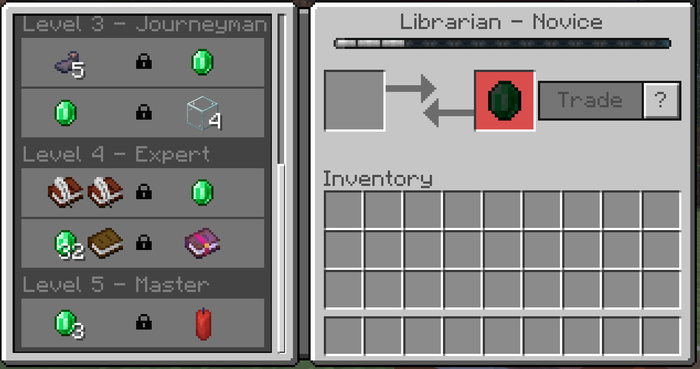
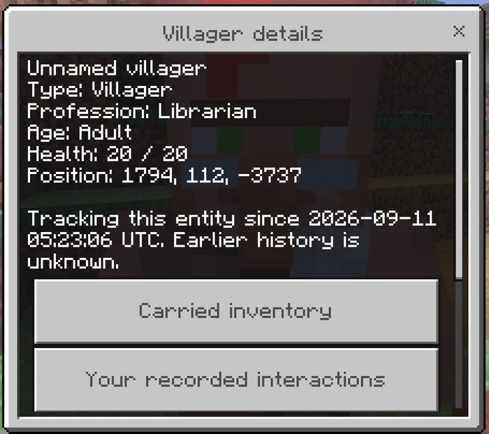
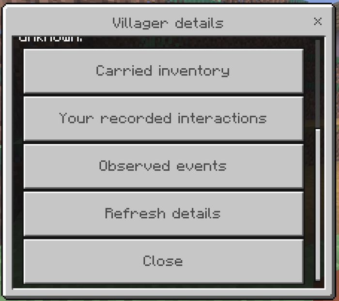
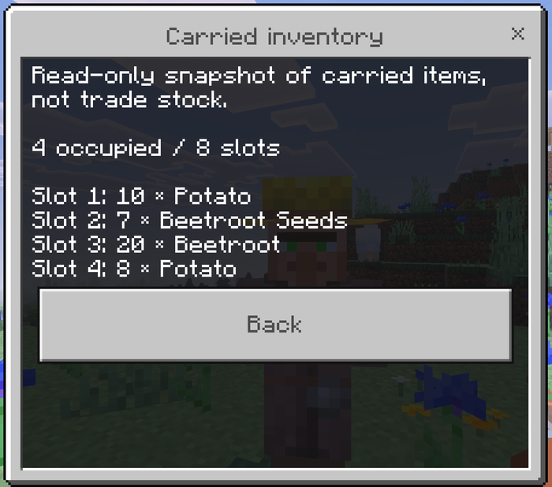
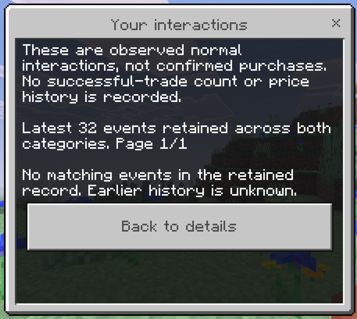
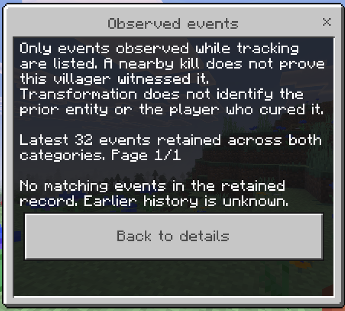

# Andy's Visible Villager Trades

See generated future villager offers while Minecraft keeps them locked, then inspect supported villager details with an empty-hand crouch-interact.

Current version: **0.2.0** for Minecraft Bedrock **26.30+**.

[Download the combined `.mcaddon`](Andys_Visible_Villager_Trades_0.2.0.mcaddon)

SHA-256: <!-- SHA256 -->`df53eef3f4222a46cfe46db7167cbb21fa398fc9d4e0850898f91fcf3b027c08`<!-- /SHA256 -->

## Features

- Future Novice-to-Master offers shown in the familiar native trade screen
- Native prices, demand, discounts, stock, XP, quantities, locks, and item tooltips preserved
- Locked offers remain read-only until normal villager progression unlocks them
- Empty-hand crouch-interact details for villagers, zombie villagers, and Wandering Traders
- Read-only carried inventory plus live type, profession when available, age, health, curing animation, and position
- Bounded, clearly qualified records of interactions and observed events after installation
- Operator menu by interacting with a block or entity using a stick renamed `AdminTradeControll`
- Cheats-free Bedrock Dedicated Server console commands
- Standard graphics and Vibrant Visuals support

## See future offers

The preview uses Minecraft's generated offer data and leaves future rows locked. Scroll normally to inspect the rest of the villager's generated progression.

## Inspect villagers

## Recorded activity

The add-on records normal interactions separately from confirmed purchases and clearly explains the limit in the panel.

Observed events are also limited to what happened while the entity was tracked.

## World controls and graphics

World operators can manage every inspector category with `AdminTradeControll` or the documented dedicated-server commands. The Resource Pack declares PBR support for Vibrant Visuals.

## Install

1. Download and open the `.mcaddon` with Minecraft.
2. Edit the target world and activate the add-on. Confirm its linked Behavior and Resource Packs are both active.
3. Leave experiments and cheats off.
4. Open a villager's trade screen to browse future tiers.
5. Empty your main hand, crouch, and interact with a supported trader to open Villager Details.

World settings affect the inspector and its recording categories. Future-offer visibility remains active while the Resource Pack is active. The stable API cannot confirm completed transactions or recover earlier entity history, so interactions are labeled “purchase unconfirmed” and unknown history is left unknown.

For setup, commands, limits, and troubleshooting, see the [Player Guide Wiki](https://github.com/CharlesJGantt/Andys-Visible-Villager-Trades/wiki).

Both manifests include the add-on product declaration, use stable API modules, and require no beta APIs, experiments, cheats, or external dependencies. Fresh-world achievement verification remains documented in the project test plan.

## License

All Rights Reserved. Players, servers, Realms, and content creators have the permissions stated in [LICENSE.md](LICENSE.md). Minecraft is a trademark of Microsoft Corporation; this project is not affiliated with Microsoft or Mojang Studios.
